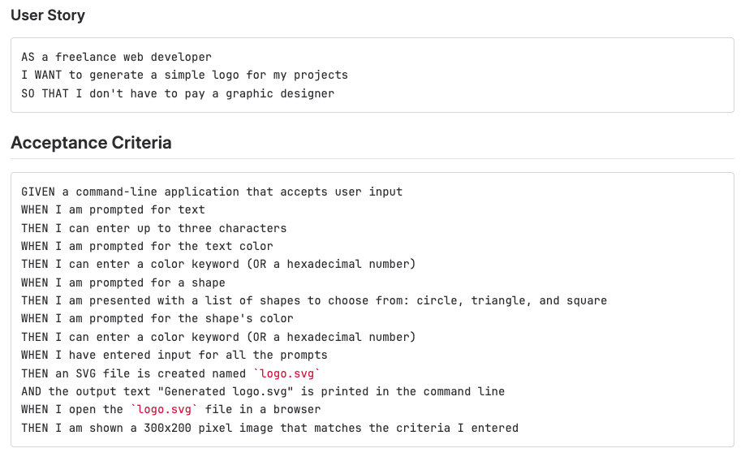

# Logo-Maker-SVG

## Description

In this project, I was tasked with building an application designed to allow a user to create a simple logo using only the command line.
The user will be prompted to answer four(4) questions intended for designing the logo.

1. Please enter the text for your logo. (Maximum of three(3) characters)
2. Please choose a text color. (Enter a keyword or hexadecimal)
3. Please select a shape for your logo.
4. Please choose a color for your logo. (Enter a keyword or hexidecimal)

If the user answers each questions with a proper response then a new logo.svg file will be created.

## Installation

1. Clone this repository to your local machine.
2. Run 'npm install' to install the necessary dependencies.
3. Run 'node index.js' to initialize the application and prompt the user questions.

## Link to Walkthrough Video
[Link Walkthrough Video][https://watch.screencastify.com/v/0NydSWernYl2qA9qIrag]

## Sample Logo produced using the application

